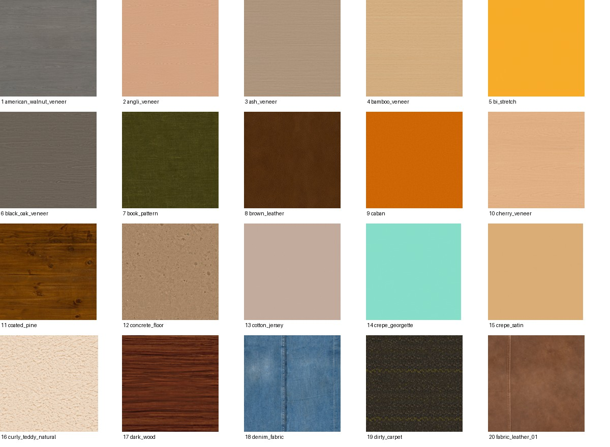
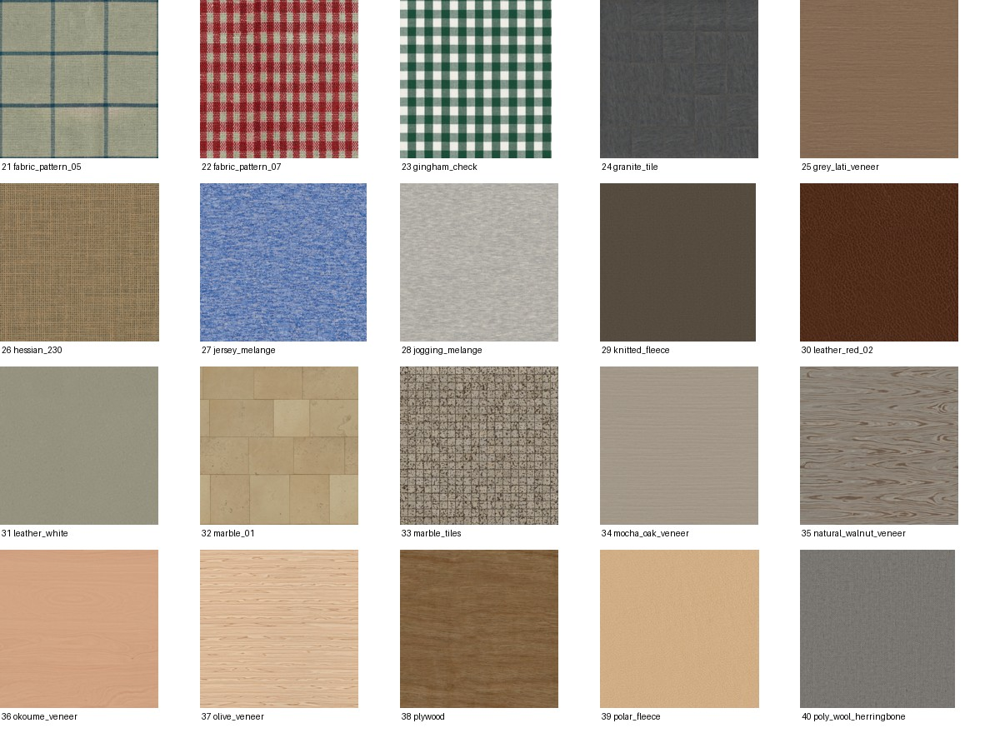
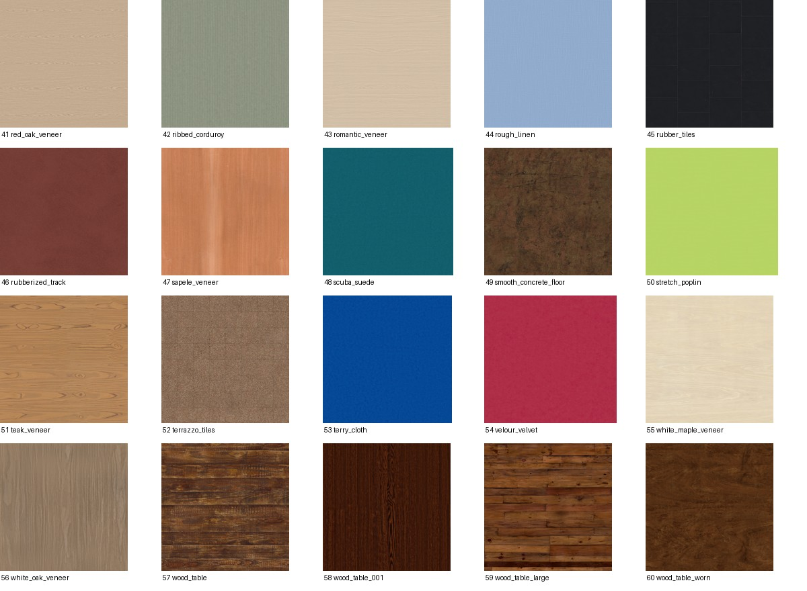

# External CC0 backgrounds — 2026-09-05

The user requested external background pictures after the old capture pack was
excluded by the Dev Mode session rule. This pack supplies **60 downloaded color
textures from Poly Haven**: 24 wood, 28 fabric/leather/carpet, and 8 stone/rubber.
All are 2K JPEG assets, totaling 175,675,103 bytes. These are surface textures;
they do not provide hands, sleeves, printed playmats, or complete binder scenes.

[Poly Haven's asset license](https://polyhaven.com/license) is CC0 and permits
commercial reuse. Its [FAQ](https://docs.polyhaven.com/en/faq) explicitly allows
AI training. Files were obtained through the public API/download service; only
diffuse or named color maps were selected, not normal/roughness maps or preview
renders. Every provider file size and MD5 was verified and a SHA-256 recorded.
The [API terms](https://github.com/Poly-Haven/Public-API/blob/master/ToS.md) permit
this use; the downloader identifies itself as `TCGer-Background-Curation/1.0`.

Local asset directory:
`.artifacts/card-geometry/compositor-assets/backgrounds-polyhaven-cc0-candidate-v1/`.
Open `gallery.html` there to browse the original images and source links.
`background-assets.json` is the compositor-compatible manifest; its hash is
`71d31e1ac762696a01a99729386a66bec661af1eb497e25c67413edccac3d177`.
This directory commits its snapshot, download URLs/hashes, validation report,
and three visual-review sheets. Full-size images remain in the local asset pack.

Codex visually inspected all 60 full-frame color-map thumbnails on the review
sheets: no cards, people, text overlays, or scene objects were visible. Each
asset records that reviewer, the exact image/crop hash, source URL and author.
External provider assets do not have a TCGer capture session: `sourceSessionId`
is explicitly null with an explanatory status, and the provider asset/family
identity is retained instead. No capture session has been invented or relabeled.
The existing exclusion list of all 43 Dev Mode/evaluation sessions is preserved.

Whole source-family and pHash-similarity components are assigned deterministically
to 48 train and 12 validation images. The four wood-table variants stay together;
three flagged similarity pairs also stay in one split. There are no cross-split
pHash pairs at Hamming distance <= 4 with rotation/reflection handling, and no
exact image hashes shared with either pinned evaluation successor or the real
round-two candidate. All 60 files load through the existing compositor.

This resolves the unavailable background-input pool through the user's requested
external CC0 alternative. The next stage remains generation and validation of
the complete corpus, then its release/policy/fairness freeze before round-two
training. The complete training corpus has not yet been frozen or generated
using this pack.

## Visual review

