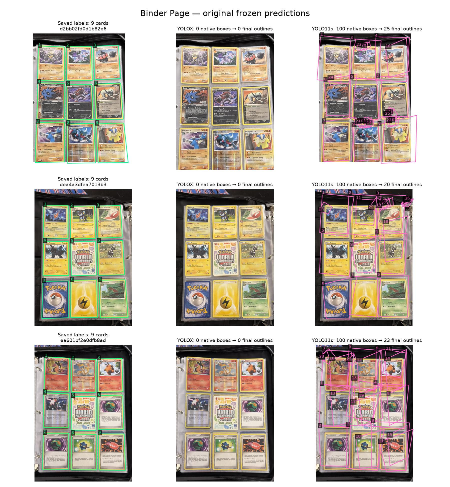
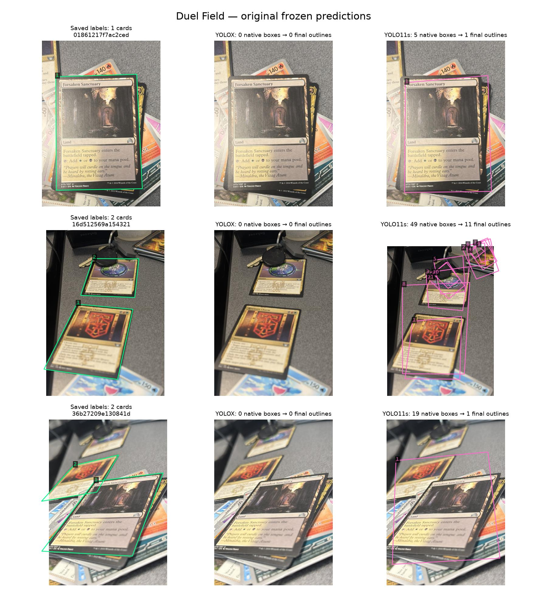
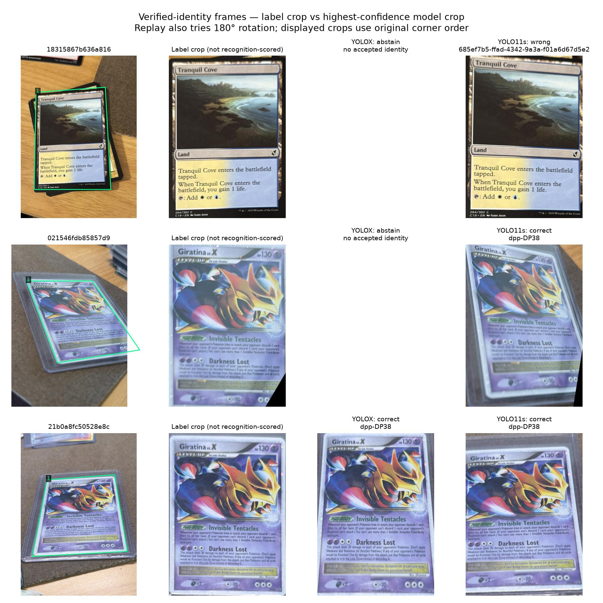

# Geometry failure analysis — 2026-09-06

**The bad binder results are real, and the training corpus has a verified category-import defect. Another run of the same corpus is not justified.** I compared all 600 evaluation records and 88 fixed validation records against their saved labels, traced failures through native boxes and raw/final quads, and visually inspected all three binder pages, three deterministic duel-field examples, three verified-identity crop examples and 24 real training images. No human relabeling, threshold sweep, new training or benchmark-label change was needed for this analysis.

## What the models actually do

A match uses the existing benchmark's one-to-one overlap assignment. IoU 0.50 means rough localization; 0.75 and 0.90 demand increasingly close outlines. High loose-overlap recall does not mean the crops are good.

| Real evaluation, 600 images / 700 labeled cards | YOLOX repaired | YOLO11s |
|---|---:|---:|
| Matched at IoU ≥ 0.50 | 421 (60.1%) | 671 (95.9%) |
| Matched at IoU ≥ 0.75 | 408 (58.3%) | 544 (77.7%) |
| Matched at IoU ≥ 0.90 | 377 (53.9%) | 321 (45.9%) |
| Missed at IoU 0.50 | 279 | 29 |
| Unmatched extras / duplicates | 7 / 0 | 288 / 26 |

YOLOX produces fewer, usually tighter outlines but misses many cards. YOLO11s finds more cards but frequently fits them poorly and retains extra outlines. Neither is a reliable real-scene replacement on this evidence.

**Binder pages are especially poor:** YOLOX emits no native boxes on any of the three images, missing all 27 labeled cards. This failure occurs before the shared quad decoder. YOLO11s emits 68 final outlines: 27 loose matches, 34 extras and 7 duplicates. Only 5 of its 27 matches reach IoU 0.75; none reaches 0.90. The pictures show outlines extending over sleeves and neighboring cards, plus numerous small stray outlines.

**Duel fields also fail:** across 18 images / 33 labeled cards, YOLOX matches 6 at IoU 0.50 and 4 at 0.75. YOLO11s matches 25 and 9 respectively, retaining 57 extras and 2 duplicates. Some images contain additional visible partial cards without a scorable saved outline, so an unmatched extra is not automatically a nonexistent physical card. The visual examples nevertheless show substantial geometric errors.

## Where YOLOX loses cards

Of its 279 missed evaluation cards:

- **249** have no matching post-framework detection box at box IoU 0.50.
- **25** have a matching raw quad that the shared decoder rejects for low confidence.
- **4** have a matching native box but no matching convex raw quad.
- **1** has a matching valid raw quad but is lost through shared NMS or one-to-one competition.

These describe which candidates are available, not a proven causal decomposition of training. Native boxes are already score-filtered and NMS-filtered by the framework; this trace cannot say whether an earlier network proposal existed. It does establish that relaxing the shared quad shape rules cannot recover the binder pages: there are zero input boxes there. All 25 matched raw quads rejected by the shared decoder fail its confidence check, not its aspect or convexity tests.

## Confirmed training-data defect

The canonical corpus correctly distinguishes `card`, `slab`, `title_region`, `info_region`, `collection_region` and `inner_border`. However, `add_canonical_archive` in `tools/card-geometry/build_real_smoke_release.py` loops over **every** canonical annotation and `_mask_instance` emits each as `detectionClass: card`, `container: unknown`. There is no category filter at that boundary.

Tracing the frozen training release back to canonical annotation provenance found:

| Split | Affected images | Non-card annotations imported as cards | Of those, trusted corner targets |
|---|---:|---:|---:|
| Train | 312 | 749 | 226 |
| Validation | 235 | 235 | 199 |

The 749 training targets comprise **235 slabs, 257 title regions, 211 information regions and 46 collection regions**. Validation contains **235 inner-border targets**. Thus 199 of the 393 supposedly trusted real-validation corner targets describe an inner border rather than a full card. Validation is not a clean whole-card learning signal.

The deterministic visual sample confirms nested slab/card outlines and title/footer regions being treated as separate cards. This defect plausibly contributes to competing detections, but the audit does not establish how much of either model's error it causes; that needs a controlled repaired-data experiment.

After distinguishing source categories, the real training split contains **6,281 actual card annotations**, of which **2,176 have trusted corners** (34.6%). Only **261 images have multiple card-category annotations**; the earlier 537 count included non-card annotations. Even 261 is an annotation count, not a verified count of distinct physical cards. Genuine binder/tabletop training examples are present, but the inspected examples have box-only supervision. Synthetic records supply the overwhelming majority of corner targets. YOLOX finds all 72 cards in the eight fixed synthetic-binder validation images, sharply contrasting with 0/27 on real binder pages. A synthetic-to-real coverage gap is supported; more training on the unchanged mix is not an established remedy.

The 502 canonical-source evaluation images contain **561 card-category annotations and no auxiliary/context categories**, so the measured category-import contamination does not apply to that portion of the evaluation release. The Dev Mode labels are a separate source and were left unchanged.

## Color handling and recognition

The fixed 88-image validation comparison confirms that BGR numpy input reproduces PIL-input predictions for YOLO11s. However, the color correction makes **no change** to real-validation matched counts at IoU 0.50, 0.75 or 0.90: **31 / 27 / 13 out of 43 scorable instances** for both paths. Across all 88 validation images, matches change from 157 to 158 at 0.50, but from 143 to 142 at 0.75 and 94 to 93 at 0.90. There is no convincing geometry gain here. The input contract should be corrected in a separately versioned evaluation path, but it does not explain away the observed failures. No corrected-color held-out result was generated.

Box-only annotations do not enter the geometry denominator. The validation sample also contains the category defect above, so its absolute recall and unmatched-extra counts must not be treated as a clean measure of real card accuracy.

Only **11** of the 57 replay frames have verified identities. YOLOX gets 2 correct and abstains on 9; YOLO11s gets 4 correct, abstains on 6 and produces 1 wrong-family result. Forty-two frames have unknown identities; four only test specific forbidden accepts. Unknown outcomes are not all recognition failures.

The wrong-family Tranquil Cove example has a visually reasonable YOLO11s crop, so geometry alone is not an adequate explanation for every recognition failure. The label-derived crops shown here were not passed through the encoder. A bounded label-crop replay is needed to separate encoder/index errors from crop errors.

Some saved corner labels also warrant targeted QA: in the steep Giratina example ending `021546fdb85857d9`, the label-derived crop extends outside the capture and loses part of the visible card. This is a specific review candidate, not a reason to discard the existing labels or redo the entire evaluation set. Historical scores remain frozen.

## What follows from this analysis

1. Repair the canonical-to-geometry importer to admit whole-card targets only, preserving genuine box-only card instances and recording excluded auxiliary/context categories. Add a mixed card/slab/title fixture and a category-consistency preflight so this cannot silently recur.
2. Audit real card labels and scene coverage after that repair; add trustworthy corners for eligible real binder, sleeve and perspective training scenes. Keep evaluation and Dev Mode images excluded from training.
3. Re-run trainer self-validation and train-split self-evaluation on the repaired material. Correct the YOLO input color contract separately; do not mix that adapter change with a new training comparison.
4. Freeze the successor corpus and experiment configuration, with existing leakage and background provenance gates, before any next training result. Keep the current results as the old baseline.

There is no need for the user to grade hundreds of obvious failures. The automated matching and source-provenance audit supply the next engineering steps. Human review is reserved for specific unresolved label or identity questions.

## Evidence and reproduction

`failure-analysis.json` contains every record's one-to-one matches and missed-card stage evidence. `category-contamination.json` lists every affected training/validation record and source category. `training-label-provenance.json` traces the 24 visual training examples. `evaluation-category-check.json` records the canonical evaluation category check. `visual-samples.json` identifies every rendered example. Both raw diagnostic reports reproduce their original accepted predictions exactly on **600/600 records**, as recorded in `result-verification.json`.

Run `summarize_geometry_failures.py --audit <this-directory>` for the metrics and `render_geometry_failure_panels.py --audit <this-directory> --images <failure-audit-inputs-directory>` for the figures. `audit_canonical_target_categories.py --canonical <corpus.jsonl> --release <training-release-directory> --output <report.json>` reproduces the category audit and checks release-record hashes. All tools are under `tools/card-geometry/`.

Validation: five focused tests cover one-to-one duplicate handling, detection-versus-decoder attribution, confidence rejection evidence, category tracing, unchanged source records and record-hash failure. Ruff passes. No model weights, release records, benchmark thresholds or human-review journal entries were changed by this analysis.
