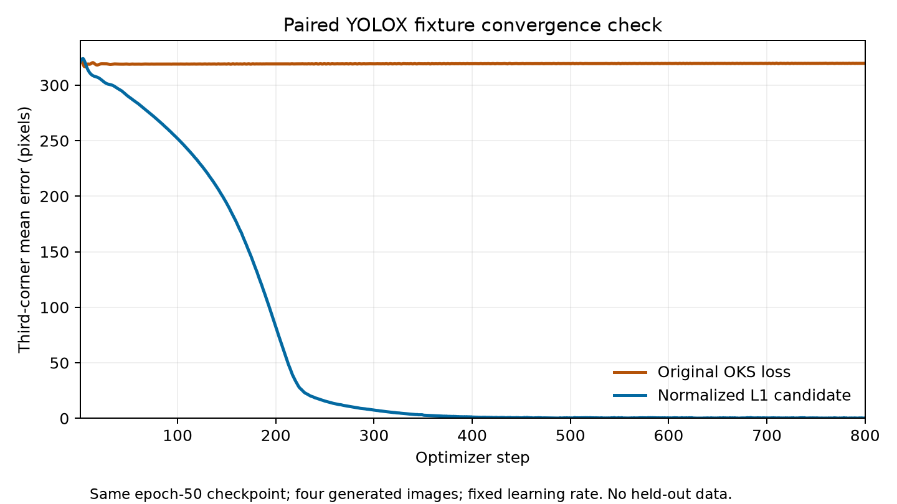

# YOLOX corner-learning diagnostic — 2026-09-06

The paired GPU probe reproduced the distant-corner gradient failure and validated a non-saturating loss candidate on generated fixtures. After 800 optimizer steps, the original loss still placed the third corner near the first and emitted no accepted quads. The candidate learned all four corners and emitted one accepted quad for each of the three corner-supervised fixture images. This establishes fixture convergence, not held-out accuracy or readiness for deployment.

The epoch-50 benchmark emitted no accepted quads. A raw-output sample showed the third corner near the first, yielding non-convex polygons. The unchanged canonical corpus contains 39,316 supervised instances; all have four corners and none duplicates the first point at the third point.

The pinned MMYOLO OksLoss computes `1 - exp(-0.5 * (distance / sigma / boxDiagonal)^2)` with sigma 0.025 and weight 30. Large errors can underflow the exponential and produce exactly zero coordinate gradient. A 200-by-300 box with its third target at (200,300) but prediction at (2,2) reproduces a 7.5 loss contribution and exactly zero gradient in float32. This is a mechanistic hypothesis to test in the actual loader and training path, not evidence from a new benchmark sweep.

## Predetermined diagnostic

Both arms start from the same immutable epoch-50 checkpoint (SHA-256 `0e377102d98e597502fad94f8ce6a1d37b70b4ef8c2dc4d09afcea4992bc8d7d`). Each uses 80 steps, four generated fixture images (including unknown-corner boxes), resolution 640, seed 20260906, fixed LR 0.0000625, no augmentation, no scheduler and no EMA. Optimizer state starts fresh in both arms. No real benchmark images or labels are used for learning or selecting settings.

The probe checks every fixture coordinate and visibility bit after the actual dataset pipeline against the COCO annotation and recorded scale factor. It also checks a distinct-corner round trip through the actual pose decoder, records the actual coordinate gradient per corner at each optimizer step, and records raw and accepted fixture predictions.

The control retains OksLoss. The candidate uses visible-corner L1 distance normalized by the box diagonal, averaged over x/y and supervised corners, with the same loss weight 30. This avoids exponential saturation and gives exactly zero coordinate loss/gradient for box-only instances. The candidate is available as `yolox_corner_loss.NormalizedCornerLoss`; it is used only in this diagnostic and does not change the default trainer or any frozen experiment.

Local verification before launch: 228 geometry tests pass and Ruff is clean. Unit tests cover distant-corner gradient direction, exact zero unknown-corner gradients, mixed visibility, and scale invariance.

## Completed paired probes

The original 80-step probe restored the third-corner gradient but did not yet produce accepted quads. An 800-step extension was therefore declared after inspecting the 80-step result, then committed before launch. Both arms reused the exact same pinned tooling, checkpoint, fixture, seed, optimizer and learning rate; only the step budget and output destination changed. See [extension plan](extension-800-plan.json) and [launch receipt](extension-800-launch.json).

| Objective | Steps | Third-corner mean error at final step | Accepted fixture quads |
| --- | ---: | ---: | ---: |
| Original OKS | 80 | 318.93 px | 0 |
| Normalized L1 | 80 | 268.50 px | 0 |
| Original OKS | 800 | 319.67 px | 0 |
| Normalized L1 | 800 | 0.34 px | 3 |

Both arms began with identical per-corner errors: 8.69, 10.58, 320.98 and 18.11 pixels. Errors above are measured on matched supervised training targets in the resized 640-pixel input, before the final optimizer update. Accepted quads are measured by raw-array inference after training through the unchanged decoder. They are separate measurements, not benchmark recall.

The original objective gave every supervised third corner exactly zero coordinate gradient at all 800 observed steps. The candidate had no such all-zero third-corner steps. Its final per-corner mean errors were 0.238, 0.211, 0.338 and 0.267 pixels. The original objective fitted the other three corners to approximately 0.06 pixels each while leaving the third corner displaced. This controlled intervention supports loss saturation as the mechanism that prevents this checkpoint from correcting its third corner; it does not establish when that corner first became displaced in the original training run.

Both actual dataset-pipeline audits had zero coordinate error and exact visibility agreement. The actual pose-decoder round trip passed in both arms. The normalized loss also gives exactly zero loss and coordinate gradient to unknown-corner instances in unit tests. The fixture's box-only image produced no raw pose detections in either arm, so this probe does not establish box-only detection recall.

The [80-step job](https://huggingface.co/jobs/ahzs645/6a9d257ae686246ca69a5254) and [800-step job](https://huggingface.co/jobs/ahzs645/6a9d26f6e686246ca69a527a) both completed. The [80-step report](results-80.json) is committed in full. The [800-step summary](results-800-summary.json) includes loader evidence, analytic gradients, milestones, final raw predictions, and the immutable Hub revision, path and SHA-256 of the full 1,600-observation report. The full report is at model repository revision `0a922b53a6da3bf735c60a41bc399915d06f9198`.

## Next experiment boundary

The loss candidate remains diagnostic-only. The original epoch-50 checkpoint, frozen round-two configuration and published benchmark results remain the historical experiment. A full repair run needs an explicit loss choice in a new hashed experiment configuration, a declared initialization and training budget, and train-split self-evaluation before evaluation on the pinned releases. Because the failure was discovered after the original benchmark, that run must be reported as a repair follow-up. The generated-fixture result here is not a replacement benchmark result.
