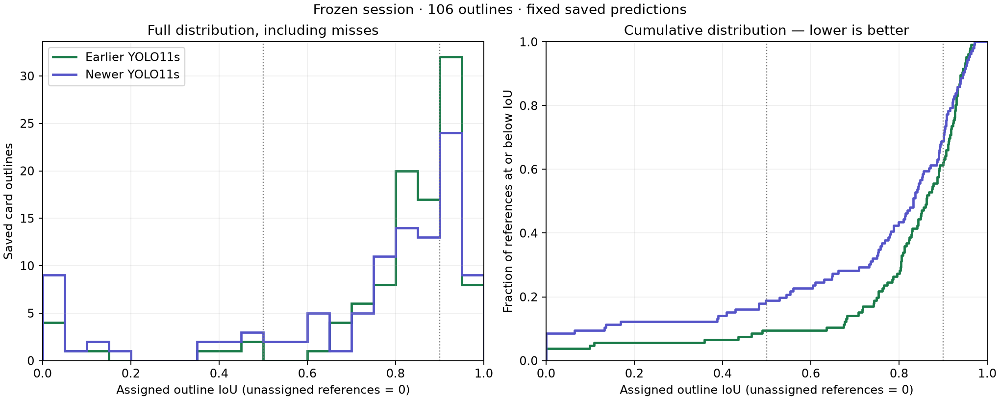

# Loss, split, seed and checkpoint audit

**Complete: September 13, 2026, 16:09 PDT (23:09 UTC).** Both training jobs, checkpoint collection and all predeclared comparisons finished successfully.

The first run used fixed-order supervision on the September 10 release; the second repeated the September 8 recipe with seed `20260906` instead of `20260905`. Each completed 50 epochs on one L4. **Keep the September 8 model as the continuity default:** the new seed found two more cards but produced fewer tight outlines on this particular session. That observation does not establish general superiority or make 40 tight outlines a justified promotion threshold. No YOLO11m run or production promotion has been submitted.

[Live local progress and plots](http://127.0.0.1:8773/ablation/) · [Fixed-order job](https://huggingface.co/jobs/ahzs645/6aa704e121047bf1b03859c4) · [Seed-repeat job](https://huggingface.co/jobs/ahzs645/6aa705f521047bf1b0385a05)

## Completed results

| Selected checkpoints, frozen 106 cards | Found, IoU ≥ 0.50 | Tight, IoU ≥ 0.90 | Mean assigned IoU |
|---|---:|---:|---:|
| September 8 development baseline | 96 | **40** | **0.7967** |
| Fixed order / September 10 split | 91 | 31 | 0.7411 |
| September 8 recipe / new seed | **98** | 29 | 0.7783 |

The new fixed-order run's balanced validation selection chose its 50th epoch. The seed-repeat row uses framework-selected `best.pt`, matching the original baseline's rule; its final checkpoint separately found 98, with 30 tight outlines and mean IoU 0.7819. Checkpoint selection never used the frozen phone session.

Fixed order improves final-epoch found-card counts over cyclic supervision on both splits, but does not consistently improve tight outlines. The new seed shifts final-epoch found cards from **89 to 98** on the same old recipe, a nine-card difference. This is larger than the observed three- and five-card loss-path differences, so seed effects cannot be assumed negligible. One repeat still cannot estimate their distribution or establish statistical significance.

These results support keeping fixed order as a candidate for further controlled work, but **do not confirm the loss as the sole cause**, settle a universal winning objective, or justify a production replacement. The next data correction needs trustworthy printed-top evidence on the actual unknown training outlines; the recognition-only audit below did not achieve that. A bigger-model experiment remains deferred.

[Verified aggregate results](RESULTS.json) · [Fixed-order gallery](http://127.0.0.1:8773/ablation/fixed-new-split-final/gallery/) · [Seed-repeat gallery](http://127.0.0.1:8773/ablation/baseline-new-seed-best/gallery/)

## Measurement limits and the next evaluation

| Contrast on the same 106-card session | Found change | Tight change | Mean IoU change |
|---|---:|---:|---:|
| Seed change, final epoch, same recipe | +9 | −3 | +0.0278 |
| Fixed minus cyclic, old split, final epoch | +3 | +7 | +0.0415 |
| Fixed minus cyclic, new split, final epoch | +5 | −2 | +0.0284 |
| Selected minus final, original run | +7 | +7 | +0.0425 |

[Exact effect sizes](effect-sizes.json)

The observed seed difference is large relative to the found-card contrasts. It is **not** a variance estimate, confidence interval or universal noise bound: the old-split loss and checkpoint-selection mean-IoU differences exceed the single observed seed change, and their tight-count differences have larger magnitude. The data do not establish that every effect lies within seed noise, or that the different loss/split runs are four interchangeable draws from one distribution.

The September 8 checkpoint was selected before the September 9 phone capture, so its within-run selection did not use this phone session. Subsequent decisions to retain it after repeated comparisons can still create selection optimism. The correct distinction is between an observed difference on this reused set and an established advantage on new captures; 40 tight outlines is a sample result, not a fixed promotion bar.

The next local pass evaluates the three latest checkpoints and their historical parents on the **same CPU path**, including final-epoch parents needed for the seed contrast. It uses the frozen **600-photo / 700-card real release** and **1,000-photo / 3,651-card synthetic release**, plus identical four-way recognition replay. The real benchmark has only 139 cards with saved human corners; 561 use imported geometry. Human-corner and imported-reference IoU distributions remain separate, and photo-balanced summaries complement card-weighted ones. More cards do not automatically mean more independent, accurate reference observations.

Recognition replay was not entirely absent: September 8 and the September 9 diagnostic have saved reports. It remains unfinished for several later checkpoints. The replay has 57 frames but sparse verified outcomes; it is useful product evidence, not a broad recognition-accuracy estimate. The new local pass will use one recognition policy for every checkpoint.

Weight averaging, a new promotion protocol, geometric augmentation with two seeds per arm, and a text-orientation training-label audit are subsequent decisions. Improvement from averaging would not prove that parental differences were only noise. Nor do these results by themselves diagnose memorization or establish that more capacity would increase variance. Fixed-order augmentation also needs correct corner semantics, visibility and winding checked before training.

## Checkpoint selection accounts for part of the apparent gap

The September 8 **selected** checkpoint finds 96 of the 106 saved cards, with 40 tight outlines. Its recovered **final** checkpoint finds **89**, with **33** tight outlines. The final checkpoint was downloaded from its original pinned training output and verified against the remote LFS digest; it was not retrained.

The primary two-by-two therefore uses **the 50th epoch for every cell** (`epoch49.pt`, zero-based), declared before evaluating the missing cell. The historical 96-versus-86 comparison remains a valid comparison of those selected artifacts, but it mixes checkpoint-selection rules and cannot isolate the supervision change.

| Same final epoch, same frozen 75 photos / 106 cards | Fixed order | Cyclic for unknown printed top |
|---|---:|---:|
| Old split, used September 8–9 | **89 found / 33 tight** | 86 found / 26 tight |
| September 10 split | **91 found / 31 tight** | 86 found / 33 tight |

Mean assigned IoU is 0.7541 for old/fixed, 0.7127 for old/cyclic, 0.7411 for new/fixed and 0.7127 for new/cyclic. The original selected baseline remains better at 0.7967. These are measurements on an already inspected diagnostic session, not a new blind test.

Secondary comparisons retained the original selection rules: framework-selected `best.pt` for the seed repeat, and the September 10 balanced validation selector for fixed versus cyclic on the new split. No checkpoint was chosen by performance on the phone session.

The recovery to 91 is evidence for the fixed-order supervision path in this run, not proof that the mathematical loss alone caused every regression. The change also selects a different dataset/trainer/validator adapter. One new seed gives one observed replicate difference; it cannot settle the full seed variance on this small, correlated session.

## What is held constant

Both runs reuse the original frozen tooling and training recipes: YOLO11s-pose, the same COCO pose initialization, 640-pixel inputs, batch 16, 50 epochs, eight loader workers, deterministic training, baked corpus variation, disabled runtime augmentation and the original container. The fixed-order run changes the corner-order policy on the September 10 release. The seed repeat changes only the training seed on the September 8 release.

Post-training evaluation is collected separately to avoid the previously broken September 10 evaluation entry point. The fixed-order run still applies the original validation selector after saving its training weights. This execution change does not alter training inputs or optimization.

The two published experiment hashes are:

- Fixed order / new split: `e6bd0d00300626e25352a271a917d91d44e69b3527816dd5a9a8f7a08bd7a056`.
- Original recipe / new seed: `95264d6cc06bb024140f892f49193cba8924ec2bc3f1c433eb294687fdcaef5c`.

Configs, input publications, preflights, job receipts, tooling hashes and the predeclared protocol are saved under `.artifacts/card-geometry/loss-split-ablation-20260913/`. Evaluation source is frozen and checksummed independently before new inference. Comparisons verify identical label, session-input, decoder, resolution, color, padding, matching and CPU runtime contracts.

## IoU distributions are implemented and measured

[`report_session_iou.py`](../../../../tools/card-geometry/report_session_iou.py) reports the full distribution with every saved reference retained. It uses maximum-total-IoU one-to-one pairing without a cutoff; an unassigned target receives zero. Unrestricted best overlap is recorded separately to expose competition between cards. This differs from the original threshold-specific matcher and does not rewrite its benchmark scores.

| All 106 saved outlines | September 8 selected baseline | September 10 selected cyclic model |
|---|---:|---:|
| Mean assigned IoU | **0.7967** | 0.7127 |
| Median | **0.8622** | 0.8327 |
| 10th percentile | **0.6551** | 0.1343 |
| 25th percentile | **0.7855** | 0.6346 |
| Zero assigned overlap | **4** | 9 |
| Mean with each photo weighted equally | **0.7968** | 0.7207 |

Overlap declined on 73 paired targets, improved on 30 and stayed unchanged on three. The three highlighted cutoff cases do lie just below 0.50 in the newer model, but each also lost substantial overlap:

| Phone-session target | Baseline IoU | Newer IoU |
|---|---:|---:|
| F6 / C2 | 0.8234 | 0.4821 |
| F25 / C1 | 0.7490 | 0.4823 |
| F71 / C1 | 0.9140 | 0.4982 |

Thus a binary metric exaggerates the abruptness of crossing a cutoff, while the continuous measurements still show real border degradation. The pattern alone does not identify its cause.

[Per-card measurements](iou-distribution.json) · [Completed final-epoch cells and protocol checks](historical-final-matrix.json)

## Printed-top proposals need a different data scope

The requested four-way recognition replay is **complete** over **610 reviewed unknown tops**, plus **600 declared-known tops** outside the frozen phone session. [`propose_printed_top.py`](../../../../tools/card-geometry/propose_printed_top.py) keeps proposals separate from labels. It requires accepted identity, a separate within-encoder rotation-score gap of at least 0.05, and agreement between accepting game encoders. It never reverses winding. Pinned model/index files, crops, source images and output rows are checksummed.

Two findings change how this should be used:

1. **609 of the 610 reviewed unknown outlines are in test; only one is in training.** The September 10 training split actually contains **2,843 real outlines with unknown printed top**, 1,060 real known-top outlines and 32,904 synthetic known-top outlines. Fixing the 610 reviewed records alone would scarcely change the current training targets. Do not move those test records into training to make the counts fit.
2. **Some declared-known labels rectify sideways.** Visual inspection found examples where the proposed phase makes the printed text upright. Disagreement with a saved known top is therefore a review flag, not automatically a recognition mistake. Nor does this establish that every proposal is correct.

The 600 declared-known checks have finished: 169 pass the proposal gate, 150 agree with the saved phase, and 19 disagree. Assistant visual inspection of those 19 found two proposals that make a sideways saved crop upright, **13 that turn an upright saved crop incorrectly**, two where both crops remain sideways, and two with insufficient visible detail. This disagreement-selected sample is not an unbiased accuracy estimate; it is sufficient to reject automatic application of this gate. [Per-example inspection](orientation-inspection.json)

The audit uses three game-specific encoders because these library rows lack verified game identities. Some confident proposals come from the wrong game's encoder; others choose an incorrect phase even with the appropriate encoder. Identity confidence and a rotation-score gap therefore do not reliably establish printed top. Independent visual/text evidence and verified game identity are needed before a versioned data correction.

The completed unknown-top replay produced **354 proposals out of 610 (58.0%)**, all in the test split. It abstained on 233 weak identity matches, 15 cases where encoders disagree on top and eight ambiguous rotations. The single training record received no proposal. These are proposal coverage counts, not correct-orientation counts. Thus this pass made **zero training-label improvements**; none of its proposals were applied. All 1,210 unique output IDs, the source-library hash, protocol and output checksums were verified. [Completed audit summary](orientation-summary.json)

The subsequent data fix should target the actual training unknowns, validate proposed tops against trustworthy examples, and publish a new versioned training release. It should remain a separate experiment from this two-by-two.

## Continuation and validation

A single local `continue.py` process followed the two existing job IDs, downloaded and verified their artifacts, evaluated final and selected checkpoints under the declared rules, produced per-comparison galleries/distributions and wrote `RESULTS.json`. It exited successfully after completion. No replacement jobs, larger-model runs or checkpoint promotions were submitted.

No training or collection process needs to remain running now. The local server is needed only to view the galleries. The automatic durable-state backup watches this task's source, reports and JSON artifacts; live databases, caches and large checkpoint copies remain local/Hugging Face.

Validation completed: both local training preflights, config/hash and job-command checks, eight focused tests covering one-to-one IoU assignment and orientation abstention, historical final-checkpoint inference with matching comparison contracts, visual plot inspection and the live page's status rendering. After completion, all 14 downloaded-file receipt entries and all three new comparison output manifests were verified again by checksum, including their IoU-distribution input hashes. Both Hugging Face jobs independently report `COMPLETED`.
